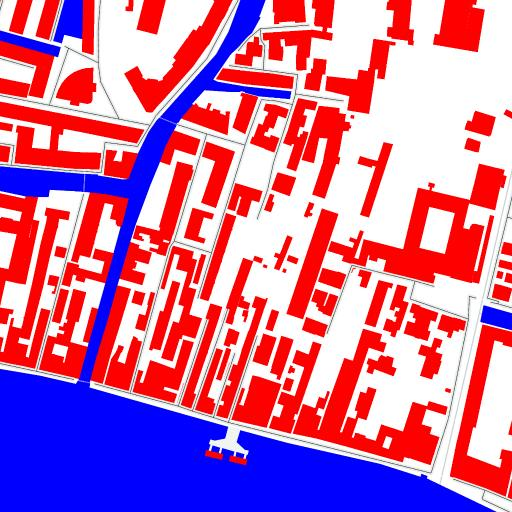
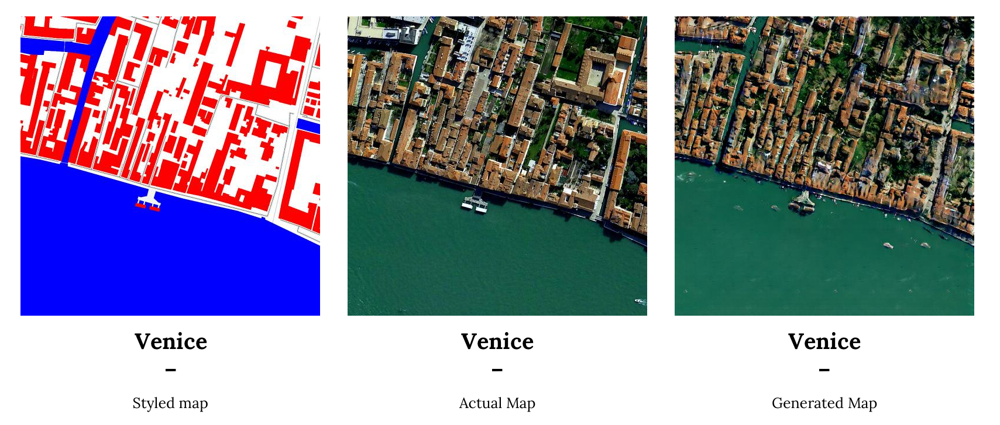
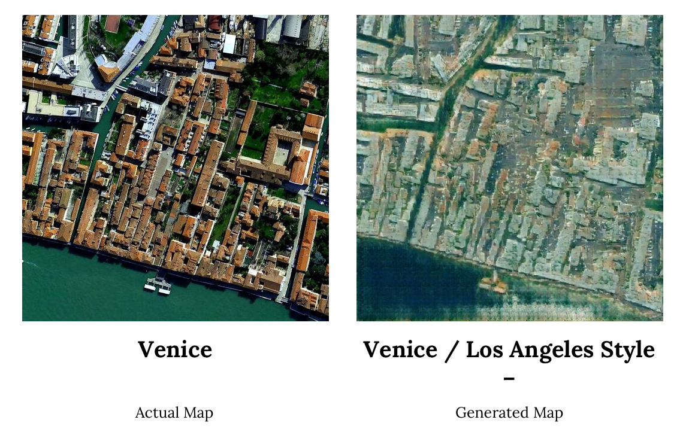
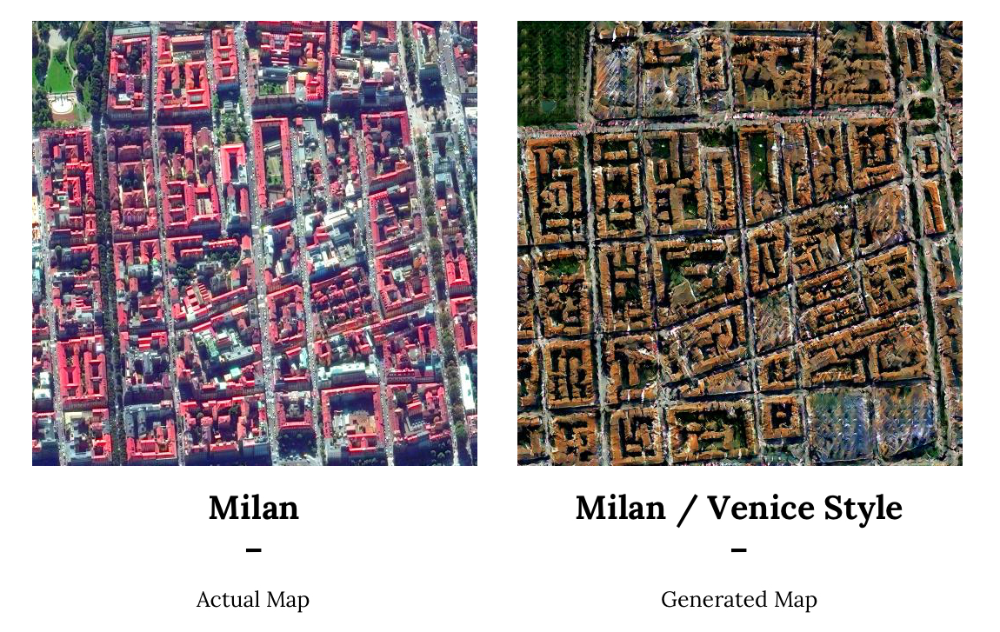
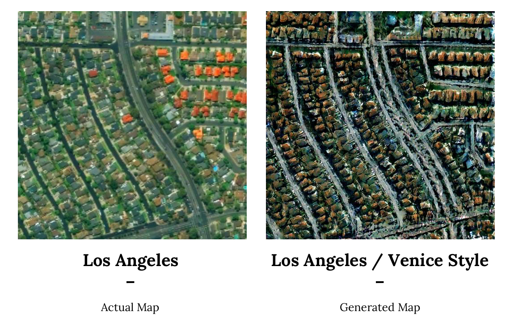

# ml4a-invisible-cities
A project made during "Machine Learning for Artists workshop" with [Gene Kogan](https://github.com/genekogan) @[Opendotlab](http://www.opendotlab.it)

## Concept
“With cities, it is as with dreams: everything imaginable can be dreamed, but even the most unexpected dream is a rebus that conceals a desire or, its reverse, a fear. Cities, like dreams, are made of desires and fears, even if the thread of their discourse is secret, their rules are absurd, their perspectives deceitful, and everything conceals something else.” 
_― [Italo Calvino](https://en.wikipedia.org/wiki/Italo_Calvino), Invisible Cities_

The idea is to create an imaginary city from a hand-drawn sketch. Trained with aerial images of real cities, a neural network can transform this into a realistic bird-eye-view city.
Then, switching between different cities references it would be possible to generate different views of the same imaginary city.

## How it works
We were fascinated by the possibility of generating new and non-existent but realistic images thanks to a neural network that *remembers* a certain set of features from the things it has seen in the past: the same process that we humans undergo when we dream.

### dataset 
Taking inspiration from the given examples, we applied a pre-defined color scheme to geographic data ([OpenStreetMap](http://www.openstreetmap.org)) using [Mapbox Studio](https://www.mapbox.com): roads, green spaces, buildings, water were styled with different colours (black, green, red, blue), so that the neural network (NN) could compare these to aerial images and learn the different features.

### training, evaluate, running
We then use [vvvv](https://vvvv.org) as a tool to collect satellite map tiles and generate images to train the network. The training consisted in comparing the output images with a validation set, and then test it on our sketches.

It then produces a set of images according to the unique characteristics of each city: the same blue shade will translate to a venetian canal or a simple river, red will became a 17th century villa or a 50s modernist house in the hills of L.A.

To encompass the variability of all geographic features, we left the background as plain white. This translated to unexpected results as the NN could interpret the same white patch of land as an airport, a maize field or a dumpster.

## Gallery

## Team
Gene Kogan
Gabriele Gambotto
Ambhika Samsen
Andrej Bolesvlasky 
Michele Ferretti
Damiano Gui
Fabian Frei

## Credits
All credit for the algorithm development to “Image-to-Image Translation Using Conditional Adversarial Networks” by  
 [Phillip Isola](http://web.mit.edu/phillipi/), [Jun-Yan Zhu](https://people.eecs.berkeley.edu/~junyanz/), [Tinghui Zhou](https://people.eecs.berkeley.edu/~tinghuiz/), [Alexei A. Efros](https://people.eecs.berkeley.edu/~efros/) published in [arxiv, 2016](https://arxiv.org/pdf/1611.07004v1.pdf).